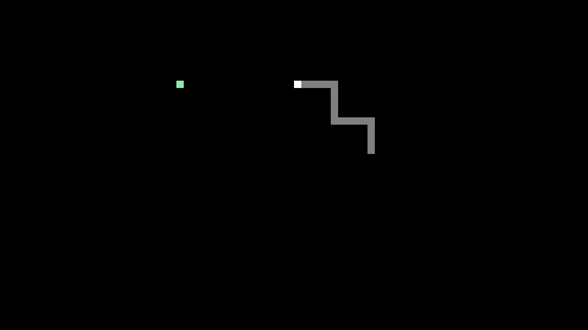

# SNAKE SDL
 Simple Snake game using SDL2.
 Tested on
 * macOS (clang + SDL2 via Homebrew)
 * Windows 10 (MinGW64 + SDL2)
 * Ubuntu 23.04 (gcc + SDL2)
 
* Movement: WASD
* Toggle fullscreen: Space
* Toggle grid: G

